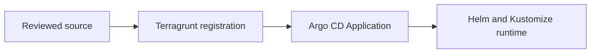

# GitOps Flow

## Flow

Reviewed source separates infrastructure registration from runtime reconciliation.

Infrastructure and application registration are modeled through Terragrunt and
OpenTofu. Runtime Kubernetes changes are delivered through Argo CD Applications
that point back at repository-owned manifests, Helm values, or Kustomize
overlays. Argo CD runs two application-controller replicas with parallel pod
management, so loss of one worker does not strand reconciliation. It globally
terminates sync operations after 15 minutes so one unhealthy
resource cannot hold an Application operation forever and block later reviewed
revisions.
The bootstrap chart carries a revision annotation on the application-controller
Pod so command-parameter changes restart the controller and take effect.

`IaC/operator` is the deliberate exception to workflow-driven apply. It owns
bootstrap permissions that the GitHub OIDC role must never change for itself;
an administrator still uses reviewed Terragrunt/OpenTofu desired state and the
shared remote backend to apply those units.

It also owns state-bucket encryption configuration through
`state-bucket-encryption`, keeping backend administration outside workload
CI. See [State Encryption](../operations/state-encryption.md) for current configuration and recovery
requirements.

Octelium recovery has one transport exception, not a desired-state exception:
a trusted LAN operator may apply the reviewed `kubernetes-node-labels`
Terragrunt unit through the canonical private API and shared remote backend when
GitHub-hosted runners cannot reach that API through Octelium. The repository
unit, saved plan, policy check, and normal Terragrunt state remain authoritative;
no ad hoc Kubernetes mutation or GitHub kubeconfig secret is introduced.

Renovate owns repo-declared workload image updates through reviewed pull
requests. Static policy requires every committed image to keep a digest pin;
live-only Argo CD parameter overrides are not steady state.

Cordium's parent Application owns normal network, secret, and host
prerequisites. At Sync wave 1 it creates the `cordium-bootstrap` child
Application only after those resources are healthy. The child source is
isolated under `clusters/homelab/apps/cordium-bootstrap`, so creation starts a
fresh 15-minute Argo CD operation instead of spending the parent's timeout
budget. Its foreground resources finalizer cascades all tracked bootstrap
resources when the parent declaratively removes the child.
The child and every Terragrunt-owned Kustomize source use autodetection and omit
empty source options because
[Argo CD v3.4.2 normalizes them to absent fields](https://github.com/argoproj/argo-cd/blob/0dc6b1b57dd5bb925d5b03c3d09419ab9fb4225e/util/argo/argo.go).
Declaring `kustomize: {}` therefore leaves the parent OutOfSync after normalization.
Cordium's privileged genesis ServiceAccount, ClusterRole, and binding are
PostSync wave -1 hooks in that child, not steady-state identities. Genesis runs
at wave 0 with a 12-minute deadline, leaving three minutes for the
resourceName-scoped PostSync/SyncFail cleanup. An ordinary failed child sync
runs cleanup and removes the identity. In-operation retries are disabled
because they retain the original operation timeout; a new full child sync gets
a fresh budget and recreates the identity at wave -1. Selective sync is
unsupported for this lifecycle. The
tracked cleanup ServiceAccount carries the genesis revision annotation so a
hook-only upgrade makes the child Application OutOfSync and starts the full
lifecycle. The CLI-native
`ClusterConfig` is packaged into the child as a generated ConfigMap and applied
at PostSync wave 1 after genesis; its generator annotation starts a full child
sync when that native-API configuration changes.
The Cordium Application is allowed to deploy control resources to `octelium`
and workspace support resources to the dedicated `cordium` namespace.
The Cordium Application prunes removed repository-owned Kubernetes manifests;
Cordium and Octelium resources generated through their native APIs remain
outside Argo CD's tracking and are unaffected by that setting.

Bazarr's public, human-authenticated native Octelium Service follows the existing single-Service
operator pattern: `scripts/octelium-bazarr-reconcile.py` previews read-only by
default and requires a clean checkout matching reviewed current `main` for
`--execute`. It applies only `bazarr.default`, verifies unchanged human-only
authorization and public routing, and requires a second apply with no changes.
The Kubernetes application itself follows the protected Terragrunt registration
and Argo CD sync path.

## Tailscale ingress foundation

The staged migration adds the `traefik` Application and the administrator-owned
`operator/tailscale-access` unit. The latter imports the existing full policy
before applying the reviewed policy and GitHub federated identities with the
Tailscale Terraform provider; CI cannot administer its own tailnet grants.
Follow its [private saved-plan runbook](../../IaC/modules/tailscale-access/README.md).

Publish the pinned Traefik image before merging its consuming runtime source.
Apply the operator policy before registering Traefik, then use protected
Terragrunt Apply on exact current `main` and check Argo's observed revision.
Application registration order alone does not establish certificate, proxy,
Funnel, or application readiness. Fleet has only a private mesh target route.

Existing DNS, Cloudflare transport, and CI access remain during this foundation.
Switch each only after its replacement passes the
[ingress acceptance gates](../runbooks/tailnet-ingress.md). This addition does not
claim that traffic has moved or old native Octelium Services have been retired.

## Important Paths

| Concern | Path |
| --- | --- |
| Root Terragrunt settings | `IaC/root.hcl` |
| Terragrunt unit index | `IaC/terragrunt.stack.hcl` |
| Per-application stack inputs | `IaC/stacks/<app>/stack.hcl` |
| Shared Application defaults | `IaC/stack-defaults.hcl` |
| Terragrunt unit templates | `IaC/.catalog/units` |
| Generated Argo CD bootstrap unit | `IaC/bootstrap/argocd` |
| Operator AWS apply-role policy | `IaC/operator/github-actions-role-policy` |
| Entra custom-domain pilot | `IaC/operator/entra-stuhlmuller-domain` + `IaC/operator/entra-stuhlmuller-pilot-user` |
| Generated Argo CD app registrations | `IaC/live/argocd-apps/<app>` |
| Argo CD Application module | `IaC/modules/argocd-application-kubernetes` |
| App desired state | `clusters/homelab/apps/<app>` |
| Platform desired state | `clusters/homelab/platform/<service>` |
| Self-management app source | `clusters/homelab/argocd/self-management` |

See [Argo CD Bootstrap](../runbooks/argocd-bootstrap.md), [Argo CD App Onboarding](../runbooks/argocd-app-onboarding.md), and
[Validation](../runbooks/validation.md) for the OpenWiki runbook summaries.

## Registration Pattern

Argo CD Applications are registered through the shared Terragrunt unit template
at `IaC/.catalog/units/live/argocd-app` and per-app inputs in
`IaC/stacks/<app>/stack.hcl`. The root `IaC/terragrunt.stack.hcl` retains explicit
unit identities, template sources, and output paths, loading each app's inputs
as its unit `values`. The generated units keep the historical
`IaC/live/...` paths so S3 backend keys remain stable. The template sources the
repository-local `IaC/modules/argocd-application-kubernetes` module and passes a
raw CRD-shaped `manifest`, so Application fields use their native names such as
`repoURL`, `targetRevision`, and `syncPolicy`. For Git-backed sources that point
at this repository, set `targetRevision` to `main` unless a temporary
non-default branch is explicitly documented for testing or recovery.

`IaC/stack-defaults.hcl` owns common metadata, project, destination, sync policy,
repository, and revision. Each active app file loads those locals and passes
`inputs.defaults = local.shared.argocd_defaults` plus only its `metadata`/`spec`
exceptions and dependencies. The template derives the
name, default namespace, and ordinary app source from the unit directory name.
Map merging preserves inherited sync settings; lists replace rather than append.
See the [registration example](../../docs/argocd-app-onboarding.md#register-with-shared-defaults)
and [Helm Chart Organization](../patterns/helm-chart-organization.md). Bootstrap, self-management,
and child-Application lifecycles keep their existing owners. The latter include
Cordium bootstrap and both storage provisioners under `platform-storage`.

The module delegates the CRD schema to `kubernetes_manifest` while retaining
repository policy for encrypted state, field-manager ownership, and the small
set of fields Argo CD or the API server normalizes. Repository-owned source
fields remain declarative. Production logs can include Terragrunt's internal
`tofu apply` subprocess even though the operator entrypoint remains the
Terragrunt workflow or `scripts/ci/terragrunt-apply.sh`.

Confirmed tainted Application state is repaired through the protected
`Terragrunt Apply` dispatch with one exact `argocd_app` and
`repair_argocd_app_state=true`. That path untaints only
`kubernetes_manifest.this`, then reuses the normal policy-checked exact-unit
plan and saved-plan apply; it does not expose a generic state mutation input.

Ordinary workloads use the `homelab-workloads` AppProject when their rendered
resources need no cluster scope. Its first tranche is Dispatcharr, OpenClaw,
Policy Bot, and Prowlarr. Platform controllers, namespace-owning applications,
and applications with audited cluster-resource requirements remain in the
`homelab` project. `n8n-postgres` remains there because its existing managed
namespace metadata requires access to the cluster-scoped `automation`
Namespace.

`platform-crossplane` currently installs only Crossplane core through the
upstream Helm chart. Before Argo CD owns Crossplane Provider, Composition, or
managed-resource manifests, add the Crossplane-recommended Argo CD tracking and
health settings to the repository-owned Argo CD configuration.

## Dependency Rule

Fleet's targeted protected `argocd_app=fleet` apply reconciles shared SSM
credentials/IAM before registering only Fleet. It requires the existing
AppProject, secret store and platform dependencies to permit Fleet first;
it does not advance the full-apply checkpoint. This avoids unrelated AzureAD
changes during a deliberately scoped rollout. The earlier Azure credential gap
is resolved; [full apply 37586972225](https://github.com/Stuhlmuller/homelab/actions/runs/37586972225)
advanced the current checkpoint. Mirror the reviewed Fleet/MySQL/Redis/bootstrap
digests to Harbor with the fixed `image_scope=fleet` dispatch before registering
the new app. The old public-DNS restoration workflow is retired; move Fleet's
existing hostname to private mesh addresses using the guarded
[DNS cutover](../../clusters/homelab/apps/traefik/CUTOVER.md). Fleet has no Funnel
route. The app's internal
PostSync bootstrap creates its first administrator, followed by a verified
database backup; both setup API aliases remain blocked. See the
[Fleet rollout](../../clusters/homelab/apps/fleet/README.md#rollout-and-validation).

Terragrunt `dependencies` blocks order Application registration. They do not
prove runtime readiness. A dependency is ready only when Argo CD reports the
upstream Application registered, synced, and healthy, or an exception is
recorded in `docs/validation-runbook.md`.

Langfuse adds a secret-bearing sibling AWS unit,
`IaC/live/langfuse-blob-storage`. Application-only filters do not execute it.
The protected full apply and targeted `argocd_app=langfuse` dispatch reuse the
same ordered shared-SSM and S3 plan/Conftest/saved-plan apply blocks before
registration. Both secret-bearing units remain excluded from PR plans. The
target reconciles the entire shared SSM unit, including existing parameter
adoption; review its private plan for unrelated updates before production
approval. It is not a Langfuse-only secret update.

The scoped path skips bootstrap and requires existing AppProject permissions,
Synced/Healthy platform dependencies, established CRDs, Ready secret store and
storage class before any repair/import/apply. It selects only the exact
Langfuse Application; it does not widen the Terragrunt filter or advance the
full-apply checkpoint. The full bootstrap sequence remains unchanged. See the
[deployment and readiness gates](../../clusters/homelab/apps/langfuse/README.md#validation).

Deleted workflow-owned units use temporary configurations at their original
backend paths. Their generated providers retain the state key-provider and
encryption-method identities, so retirement can read encrypted state and apply
only the reviewed, policy-checked destroy plan. Retained secret and backup data
remain protected by their existing ownership and policy gates.

## Provider Scope

`IaC/root.hcl` owns shared state and inputs, but it does not inject workload
providers into every unit. Kubernetes-backed units include
`IaC/kubernetes-provider.hcl`; the Argo CD bootstrap unit generates its Helm
provider locally. Keep new providers scoped to the units that use them so lock
files represent real module dependencies.

## Source Files

- `docs/argocd-bootstrap.md`
- `docs/argocd-app-onboarding.md`
- `docs/rollback-argocd-apps.md`
- `.agents/skills/terragrunt-workflows/SKILL.md`

## Private OCI publication

[Harbor](../operations/harbor-oci.md) is registered through the explicit stack.
Its PostSync Job reconciles private projects and robot credentials through the
Harbor API. CI publishes custom NOFX images only after testing and exact-main
checks; runtime digest changes remain reviewed GitOps changes. Upstream image references preserve a registry-independent bootstrap path.
The [Talos mirror rollout](../../docs/harbor-image-mirroring.md) redirects node pulls
after publication; its recovery patch restores upstream transport. Publish new
catalog digests before merging their consuming image or chart changes.
