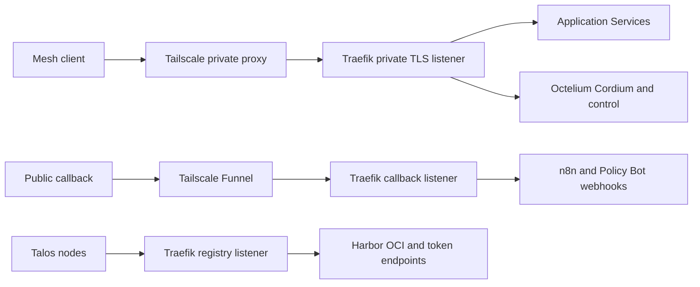

# Tailnet And App Ingress

The migration foundation declares Traefik as the reverse proxy for private
application URLs. Fleet devices and administrators use the Tailscale mesh;
Fleet has no Funnel route. Octelium remains for Cordium and its required portal,
API and console. Existing DNS and Cloudflare transport remain until cutover
acceptance; foundation source alone does not establish deployed traffic changes.

Canonical desired state and validation:
[Traefik README](../../clusters/homelab/apps/traefik/README.md),
[route inventory](../../clusters/homelab/apps/traefik/routes.yaml), and
[Tailscale provider runbook](../../IaC/modules/tailscale-access/README.md).
The older [ingress runbook](../../docs/networking-tailnet-ingress.md) describes
the retained migration source path until its traffic-cutover revision lands.



Separate listeners prevent public callbacks from selecting private routers.

## Route boundaries

`traefik-private` receives mesh traffic for the existing private custom hostnames;
cert-manager supplies their public-trust TLS certificate. `homelab-ingress` is
the Tailscale device name. Explicit file-provider routes select fixed Services;
Traefik does not discover arbitrary workloads. Fleet's setup paths remain denied.

Only `n8n-webhook.tail67beb.ts.net` and `policy-bot-hook.tail67beb.ts.net` use
Funnel. The former accepts the three declared webhook path families; the latter
accepts exactly `/api/github/hook`. Application webhook authentication remains
required. Root/admin paths and spoofed private Host headers fail at the callback
listener. Encoded reserved path characters are rejected on these sensitive routes.

Cordium and native Octelium API paths retain WebSockets and h2c. The console alone
uses the existing Istio HTTPS gateway with verified upstream SNI to preserve its
conditional login-redirect correction. This retained control dependency is
separate from the direct application proxy routes.

Talos uses a dedicated `10.96.0.50:443` registry Service and host-only DNS patch;
see [Harbor](../operations/harbor-oci.md). It exposes OCI/token paths only, not
Harbor management or unrelated application hosts. Registry port 9443 permits
only the four fixed LAN node addresses and their verified `cni0` bridge `/32`s
(`10.244.1.1` through `10.244.4.1`), with no authenticated mesh principal.
Talos host-to-Service SNAT can select a bridge source; ordinary Pod CIDRs are
not allowed. Converge these policies before the worker-first host-only mapping,
then require an uncached successful pull from every node before Harbor DNS
changes. See the [dated failed-pull and node-readiness findings](../operations/harbor-oci.md#private-node-registry-foundation).

## Tailnet Lock

Keep Tailnet Lock enabled. A new operator proxy can be Ready and authorized yet
remain invisible to mesh peers because it lacks a node signature. From the
trusted Mac's existing homelab profile and an authenticated LAN Kubernetes
context, preview and then execute from clean, signed current `main`:

```sh
python3 -I scripts/tailscale-ingress-sign.py
python3 -I scripts/tailscale-ingress-sign.py --execute
```

The fixed signer checks the private Service and two Funnel Ingresses against
controller-owned Ready Pods, exact parent UID, hostname, tag, addresses and
local lock-peer identity. It reads public node/rotation keys from those Pods and
signs only those three targets. It never adds a signing authority or disables
Tailnet Lock. Already-signed targets are skipped; lost proxy state requires the
same guarded process again.

CI uses three provider-managed reusable ephemeral keys, signed on the trusted
Mac and published by `tailscale-ci-configure.py`. Run its read-only preview and
then `--execute`; it accepts no arbitrary key or GitHub target. Preserve its
private signature cache. Rotate the committed generation every 60 days, before
90-day expiry, and verify protected plan/apply/Cordium acceptance. Then use
`--retire-previous --execute` to remove only cached older-generation signing
authorities. Expired auth keys alone do not remove embedded signing authority.
The [provider runbook](../../IaC/modules/tailscale-access/README.md) owns exact
secret scopes, private saved-plan commands, recovery, and the accepted signing-key
tradeoff. Each CI job must supply a private `statedir` to the pinned action.

## Security and rollout gates

Traefik joins ambient and app authorization policies trust its dedicated service
account. Tailscale ACLs govern external mesh access. Flannel does not enforce the
NetworkPolicy manifests: they express intended peers, not current isolation.
AFFiNE, NOFX, OpenClaw and Policy Bot allow encrypted HBONE on port 15008
separately from cleartext source selectors, leaving workload identity and
destination-port checks to Istio AuthorizationPolicy.
Istio rejects unrelated authenticated mesh principals; unmeshed intra-cluster
callers still require application authentication. Registry source-IP restrictions
have a trusted node-local bypass. Do not claim full east-west isolation.

Publish Traefik's reviewed image, adopt policy through the operator Terraform
unit, then register and verify the GitOps resources. Require Ready certificates,
healthy proxies and actual application access from a mesh client before changing
DNS. Preserve current app state and enrollment URLs; confirm Fleet check-in,
native Cordium execution/reconnection, and uncached node registry pulls.

Switch webhook registrations after public reachability and negative-path checks;
require fresh signed delivery before retiring the former callbacks. Migrate CI to pre-signed ephemeral mesh keys only after its API proxy,
RBAC and admission boundary are deployed. Retire old DNS, Cloudflare Tunnel and
non-Cordium native Services through their reviewed code paths after all callers
move. Validate a second retirement run is a no-op. Use reviewed reverts and the
owned DNS/node helpers for rollback; never repair live routing by hand.

On October 10, strict-TLS GET checks through external Funnel relay addresses
passed all 20 tested root/admin/private-Host negative cases. This proves those
rejection paths only; authenticated callback delivery and complete traffic
cutover remain separate gates.

## Cutover utilities

Follow the [staged cutover](../../clusters/homelab/apps/traefik/CUTOVER.md).
The additive `tailscale-private-dns.sh` previews by default and requires exact
reviewed main to write only its fixed DNS-only A/AAAA inventory. It preserves
legacy CI, callback and carrier names. First disable the old DNS-restoration
workflow through code, preserve its tunnel, and verify Talos registry access.
Before DNS preflight, `multica-desktop-connect.py --resume-only` reconnects only
the verified saved tailnet profile and checks the ingress peer. It polls at most
20 times with half-second pauses for the same macOS profile to become online,
rejecting any owner or tailnet change. Each CLI call retains its separate
45-second timeout; Desktop credentials and the local carrier remain unchanged.
After DNS readback, the Mac helper migrates the verified existing account while
preserving credentials and owned-file rollback. Wait the reported former TTL,
then explicitly verify normal DNS, canonical TLS and native gRPC.

The callback helpers change only the fixed n8n hooks and Policy Bot App webhook
URL. Non-executing preflights protect live workflows; private local receipts
require both a newer delivery ID and timestamp after cutover. Historical success
cannot satisfy acceptance. The CI publisher captures sensitive provider keys
privately, signs via temporary files and publishes only three scoped GitHub
secrets after checking signed current main, environment protection and the
trusted homelab signing profile. It removes the old client-ID variables only
after all three writes and metadata checks succeed. These utilities do not switch
CI workflows or retire the native catalog by themselves.

See [Validation Gates](../operations/validation-gates.md),
[Secrets And Identity](../architecture/secrets-and-identity.md), and
[Workload Inventory](../workloads/inventory.md).
