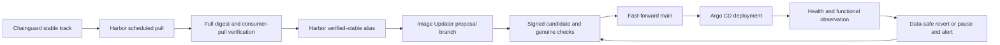

# Implementation Plan: Chainguard Image Automation

<!-- markdownlint-configure-file { "MD013": { "tables": false } } -->

**Branch**: None created; checkout is detached at `a13975c`.
Spec Kit feature label: `002-chainguard-image-automation`.

**Date**: 2026-10-05 | **Spec**: [spec.md](spec.md)

**Input**: `specs/002-chainguard-image-automation/spec.md`

## Summary

Migrate every compatible active workload to verified Chainguard images in
Harbor, with explicit exceptions. Reuse Harbor's native scheduled replication
and existing publication checks. Restore Argo CD Image Updater to propose
digest changes from a verified Harbor alias. A main-owned GitHub workflow
validates a signed candidate and advances main without a PR, then observes
rollout and performs data-safe recovery.

The direct-write path requires a reviewed companion change in
`Stuhlmuller/github-iac`. A dedicated promoter may bypass PR governance only;
signatures, non-force history and genuine validation remain mandatory. If that
scoped path cannot be delivered, use the specified automatically merged PR
fallback. Never grant Image Updater an unrestricted main bypass.



## Technical Context

**Language/Version**: Existing Nix-pinned Python 3 stdlib, Bash, YAML/JSON,
Terragrunt/OpenTofu HCL; no new language runtime or package framework.

**Primary Dependencies**: Existing Harbor 2.15.2/chart 1.19.2, Argo CD
3.4.2/chart 9.5.15, Skopeo, Helm/Kustomize, GitHub Actions/Apps/API,
External Secrets/AWS SSM. Restore Image Updater v1.3.0/chart 1.3.1. Resolve and
publish controller digest before consuming it; keep current platform versions.

**Storage**: Existing Harbor blob storage; repository enrollment/publication/
recovery JSON; native GitHub Deployment/status journal. No new database or PVC.
Retain current and previous known-good artifacts; introduce no deletion policy.

**Testing**: Existing static gate, Harbor bootstrap/publication/catalog tests,
chart rendering, Spec Kit smoke check; one focused stdlib test file for new
promotion/recovery trust boundaries; per-consumer runtime acceptance and failure
drills through declared workflows.

**Target Platform**: Existing Talos Kubernetes homelab and Linux CI runner.
Required platforms are explicit per enrollment, checked against image indexes
and actual consumer placement; do not assume amd64-only operation.

**Project Type**: Declarative infrastructure and GitOps automation, extending
existing bootstrap and CI paths.

**Performance Goals**: Hourly imports and five-minute verification/supervision;
two-minute updater polling. Verify import within 6 hours, validate/commit within
1 hour, observe healthy rollout within 30 minutes, safe rollback within 30
minutes of failure detection, unsafe/unknown/failed recovery pause and alert
within 5 minutes. Measure actual service and queue latency; cron alone is not
acceptance evidence. Dependency availability assumptions follow the spec.

**Constraints**: Public repository, no secret disclosure or restricted public
copies; exact candidate checks, signed conventional commits, no force pushes;
stable major upgrades permitted only after real compatibility evidence; no
automatic data restore; no ad hoc live mutations or desired-state environment
overrides. Configuration/enrollment/permission changes retain normal review.

**Scale/Scope**: One homelab. Initial declaration scan found 85 valid named
references across 76 families plus seven unresolved digest-only chart pins;
this is not the complete active inventory. Reconcile rendered/live containers,
hooks and operator defaults before claiming 100% assessment. Start with the
stateless Python Harbor vulnerability exporter, then complete all eligible
consumer migrations and evidence-backed exceptions.

## Constitution Check

The constitution file is an unfilled template, not ratified project policy.
The following gates apply the actual AGENTS.md and clarified user requirements.
Pre-research and post-design checks both pass for this plan; operational
activation remains conditional on the listed evidence.

| Gate | Before research | After design |
| --- | --- | --- |
| Declarative ownership and reproducibility | Required | Pass: shared Terragrunt app/SSM owners, Harbor bootstrap, GitOps and main-owned CI; no generated `IaC/live` edits. |
| Normal review and scoped exception | User explicitly requested routine bot writes | Pass: companion github-iac rulesets; bot cannot alter enrollment or permissions; exact signed C tested before main. |
| Secret and access boundaries | Existing public/private separation required | Pass: separate proposer/promoter identities, runtime/CI grants, private destinations for restricted sources. |
| Publish before consume | Existing Harbor rule required | Pass: digest/platform/full-download receipts precede eligible alias and consuming main commit. |
| Recovery and persistent data | User chose safe rollback, otherwise pause/alert | Pass: current-data evidence, retained artifacts, durable rejection and one recovery attempt; no automatic restore. |
| Original behavior and full scope | Every active consumer must be assessed | Pass: initial family matrix plus mandatory rendered/live inventory and per-consumer acceptance before completion. |
| Bootstrap and operational validation | Preserve one-root apply and known recovery path | Pass: extend shared stack, activate last, retain declared upstream recovery; no new cluster mutation path. |
| Durable documentation | Knowledge-base update required | Pass: proposed design linked in Harbor note, including inventory parser finding and external governance owner. |
| Smallest sufficient implementation | Reuse native/platform facilities first | Pass: native replication/updater/GitHub Deployments, existing CI; no new controller, database or generic abstraction. |

## Project Structure

### Documentation (this feature)

```text
specs/002-chainguard-image-automation/
├── spec.md
├── plan.md
├── research.md
├── migration-inventory.md
├── data-model.md
├── quickstart.md
├── contracts/image-automation.md
└── checklists/requirements.md
```

`tasks.md` belongs to the subsequent `$speckit-tasks` phase and is not created
by this plan.

### Source Code (repository root)

Planned changes reuse these owners; new files are explicitly marked.

```text
IaC/
├── terragrunt.stack.hcl
├── stacks/{harbor,argocd-image-updater}/stack.hcl
├── modules/aws-github-actions-role-policy/    # narrow automation role/grants
└── .catalog/units/
    ├── operator/github-actions-role-policy/terragrunt.hcl
    └── live/aws-ssm-parameters/terragrunt.hcl
clusters/homelab/apps/
├── harbor/
│   ├── bootstrap.py
│   ├── kustomization.yaml
│   └── image-automation.json                 # new enrollment/assessment
├── argocd-image-updater/
│   ├── values.yaml
│   ├── kustomization.yaml
│   ├── externalsecret.yaml                   # new, fresh proposer credentials
│   └── managed-images.yaml                   # new, generated enrollment targets
└── kiali/                                    # example startup adaptation
scripts/
├── harbor-image-inventory.py
├── ci/
│   ├── image-automation.py                    # new fixed orchestration/checks
│   ├── image-automation-test.py               # new focused trust/recovery tests
│   ├── harbor-{images,render}-check.py
│   ├── harbor-{bootstrap,publish}-test.py
│   ├── harbor-publish.sh                      # reuse verification, preserve gate
│   └── static-checks.sh
└── config/image-automation-state.json         # new receipts/pause/rejections
.github/workflows/
├── image-automation.yml                       # new main-owned supervisor
├── validate.yml
├── lint.yml
├── terragrunt-plan.yml
├── release.yml
└── codeql.yml                                # genuine candidate checks
docs/
├── argocd-image-updater.md                    # replace retirement guidance
├── harbor-image-mirroring.md
└── knowledge-base/                           # ownership, secrets, recovery
```

Migrate other app values/manifests according to the inventory.
Update existing Renovate configuration and affected secret/backup/bootstrap
runbooks in place. No separate configuration service. The authoritative
enrollment file is local to Harbor's ConfigMap generator; derive the updater
resource deterministically to avoid duplicate policy sources.

The exporter and Harbor bootstrap currently share their old Python reference.
The reviewed exporter migration first gives only that manifest the explicit
Harbor repository, then targets that repository in Kustomize. Rendering must
prove that the pilot does not also update the bootstrap Job.

**Structure Decision:** Extend current app bootstrap, shared stack and CI
boundaries. GitHub App/bootstrap declarations, rulesets, environment grants and
their validators stay in the companion `Stuhlmuller/github-iac` repository.
This planning change does not modify that repository or provision credentials.

## Delivery sequence and evidence

1. **Complete assessment and governance prerequisites.** Repair the inventory
   parser with a regression case; reconcile declarations, all pinned renders,
   live Pods and operator defaults. Record one assessment per active consumer.
   Prepare the companion ruleset/App/environment changes and prove candidate
   check execution. No bot main bypass is activated before the gate exists.
2. **Deliver import and publication verification.** Extend existing Harbor
   reconciliation, implement/test the pilot's release-metadata recipe in US1,
   then enable import enrollment and full-copy receipts, retain digest tags
   and gate `verified-stable`. Workload health/data recipes are a later
   consumer-enrollment gate, not a prerequisite deferred beyond US1 acceptance.
   Keep consumers and updater disabled until actual publication evidence exists.
3. **Restore the constrained updater and promotion workflow.** Publish its
   controller image first, restore fresh ESO credentials, render exact targets,
   remove the retirement marker, and deploy with zero enrolled writes until
   candidate checks and bot identity tests pass. Reconcile stale proposal data
   against current main; reject unrelated fields.
4. **Migrate the stateless pilot.** Reviewed enrollment/image-origin change,
   exclusive update ownership and startup/function acceptance precede automated
   activation. Once recovery is ready, run release acceptance and recovery
   drills independently. Select verified real major/rebuild sample pairs in
   T042; use a separate isolated major-version canary if the Python pilot has
   no suitable pair. Missing samples keep SC-004 open without blocking recovery
   drills. Test signed promotion, operation-specific rollback/control gates,
   stale-base and denied-write behavior through declared resources/workflows.
5. **Finish compatible consumers.** Migrate each remaining proven equivalent;
   add reviewed startup adaptations and data migration paths where needed.
   Keep non-equivalents, unavailable packages and incompatible platform groups
   as specific migration exceptions. Compatible non-Argo consumers migrate
   through their existing reviewed owner; only updater enrollment is exempt.
   Exercise unsafe/unknown/failed recovery and alerts.
6. **Close acceptance and docs.** Reconcile full inventory, timing evidence,
   recovery/cold-bootstrap runbooks and current/previous pullability. The pilot
   alone is not feature completion.

| Requirements | Design / acceptance coverage |
| --- | --- |
| FR-001, FR-011, SC-001, SC-006 | Complete consumer inventory, fixed compatibility/health/data recipes, original-function acceptance and recovery drills. |
| FR-002–FR-006, FR-014, SC-002, SC-004, SC-005 | Explicit enrollment, native pulls, stable metadata, full verified receipts, retained digests and denied/incomplete publication tests. |
| FR-007–FR-010, SC-003, SC-007 | Scoped updater, proposer/promoter split, exact C checks, signed non-force promotion, Renovate ownership and stale-base/scope tests. |
| FR-012, SC-007 | Managed runtime/CI secret boundaries, intended-access pulls and restricted-source negative tests. |
| FR-013, FR-015, SC-006 | Deployment journal, current-data recovery, persistent pause/rejection and timed actionable notification. |
| FR-016, FR-017 | Existing declarative delivery, bootstrap path, runbooks and knowledge-base reconciliation. |

Detailed checks and prerequisites: [quickstart.md](quickstart.md).
Design evidence: [research.md](research.md).

## Complexity Tracking

No unjustified gate violations. Two GitHub App identities separate cluster
proposal access from privileged promotion; one identity cannot satisfy that
boundary. The small CI coordinator is needed because Image Updater lacks
pre-main validation and data-safe recovery. Everything else reuses existing or
native facilities.

## Planning validation

- All six design artifacts exist; local links and template checks pass.
- Markdown lint passes for all nine feature/knowledge-base Markdown files.
- Spec Kit Python/Bash smoke checks and `git diff --check` pass.
- The repository static gate passed earlier in this feature workflow. Subsequent
  edits are documentation only; no infrastructure or runtime validation is
  claimed by this plan.
- Pre/post plan hooks skipped: `.specify/extensions.yml` is absent.
- No branch, `tasks.md`, commit, deployment or GitHub permission change created.
