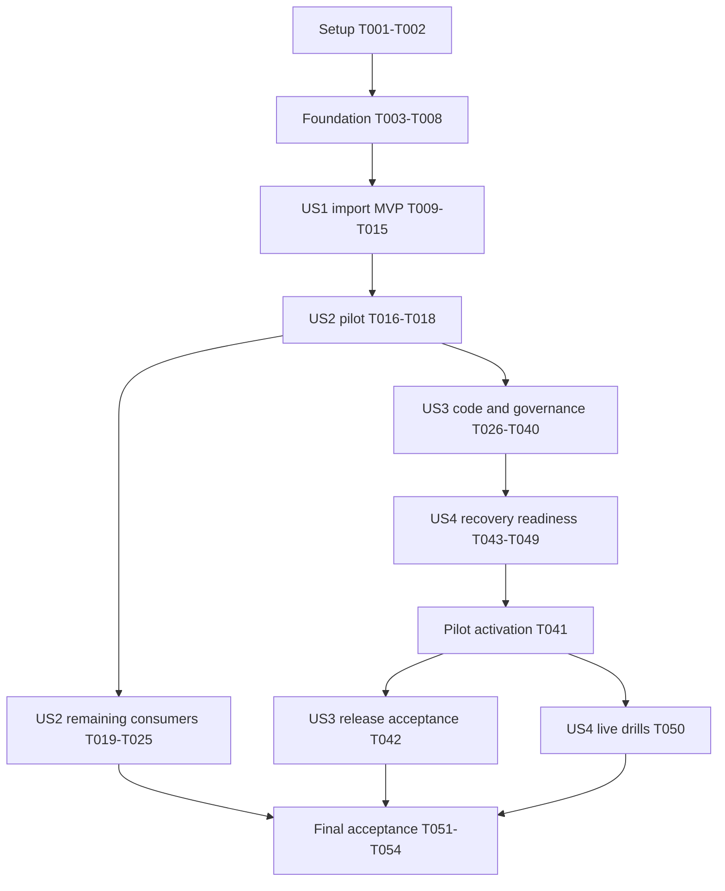

# Tasks: Chainguard Image Automation

<!-- markdownlint-configure-file { "MD013": { "tables": false } } -->

**Input**: [plan](plan.md), [specification](spec.md), [research](research.md),
[data model](data-model.md), [contracts](contracts/image-automation.md),
[inventory](migration-inventory.md), and [validation guide](quickstart.md).

**Scope**: Implementation backlog only; generating this file performs no
implementation, merge, permission change or deployment. Existing merge holds
remain effective until their owner releases them. Use signed conventional
commits and the declared reviewed delivery paths during implementation.

**Tests**: The specification explicitly requires independent acceptance and
failure drills. Extend existing Harbor tests and one focused stdlib automation
test file; no new test framework or per-function test scaffold. Add each
regression before its implementation and confirm it detects the missing guard.

**Paths**: Relative to this repository unless prefixed `github-iac:`, which
means the companion `Stuhlmuller/github-iac` repository, not a local homelab
subdirectory. Named new files are implementation outputs. Consumer-specific
paths discovered in T005 become authoritative inventory fields used by the
migration cohort tasks; no inferred repository-wide image replacement.

**Format**: `- [ ] Tnnn [P?] [USn?] Action with file path`. `[P]` identifies
independent files within the dependency windows described below. All 54 tasks
start unchecked; successful research is not implementation acceptance.

## Phase 1: Setup

**Purpose**: Refresh the baseline and external prerequisites without changing
live state. Reuse the existing Nix/toolchain and Spec Kit structure.

- [X] T001 [P] Record the implementation baseline and actual validation results
  in `specs/002-chainguard-image-automation/quickstart.md`: preserve existing
  feature work, select a `codex/` implementation branch, run the Spec Kit smoke
  check and repository static gate, and record unavailable checks explicitly.
- [X] T002 [P] Refresh drift-sensitive controller/chart pins, source access,
  GitHub checks/App identities, rulesets and environments in
  `specs/002-chainguard-image-automation/research.md`; verify the companion
  owner paths and record activation prerequisites without changing settings.

## Phase 2: Foundational prerequisites

**Purpose**: Establish complete inventory, strict shared data contracts and a
declared credential lane before any story's operational activation.

- [X] T003 Add the embedded Helm `image:`/`tag:` newline regression and
  digest-only-pin cases to `scripts/ci/harbor-images-check-test.py`, importing
  the inventory helper where necessary; reproduce the fabricated
  `docker.io/library/tag:latest` result before fixing it.
- [X] T004 Fix image extraction at its source in
  `scripts/harbor-image-inventory.py`; preserve controller arguments, embedded
  manifests and ordinary references, and pass T003 without hiding unresolved
  chart pins or silently dropping real consumers.
- [ ] T005 Complete the consumer-level assessment in
  `specs/002-chainguard-image-automation/migration-inventory.md` using the fixed
  helper, every pinned render from `scripts/config/harbor-image-charts.json`,
  read-only live Pods and operator defaults; record exact resource/container and
  desired-state file/field, current digest, architectures, owner, candidate
  access, evidence and reconsideration condition for every exception.
- [X] T006 [P] Add shared contract rejection cases in
  `scripts/ci/image-automation-test.py` for duplicate/unknown fields, unsafe
  paths/symlinks, ambiguous targets, unsupported recipes, missing platforms,
  broad selectors and restricted-source/public-destination mappings.
- [X] T007 Implement strict shared `check` validation in
  `scripts/ci/image-automation.py` and initialize
  `clusters/homelab/apps/harbor/image-automation.json` plus
  `scripts/config/image-automation-state.json`; record T005 assessments with
  separate migration/automation status, explicit ownership and paused updates.
  Start with empty active import/update enrollments, without placeholder recipe
  IDs. Import enrollment later requires an implemented release recipe; automatic
  consumer enrollment additionally requires implemented workload/recovery
  recipes.
- [ ] T008 [P] Declare and deliver the narrow CI credential lane through
  `IaC/modules/aws-github-actions-role-policy/main.tf`,
  `IaC/modules/aws-github-actions-role-policy/variables.tf`,
  `IaC/.catalog/units/operator/github-actions-role-policy/terragrunt.hcl`, and
  `github-iac:Stuhlmuller/repositories/terragrunt.hcl`; use a dedicated
  main-only automation role/environment with exact publication, connectivity,
  SSM/KMS and notification grants, preserve existing environment reviewers, and
  pass format/plan/policy gates before reviewed apply. Do not reuse the broad
  infrastructure apply role for unattended automation.

**Checkpoint**: T003–T008 pass; every consumer has a concrete assessment and
shared input validation is executable. App keys and the direct-write exception
are still disabled pending US3. No custom service or database is introduced.

## Phase 3: US1 — Keep selected images available in Harbor (P1, MVP)

**Goal**: Automatically import and verify accessible Chainguard images without
changing workload references.

**Independent test**: One source change becomes fully downloadable from Harbor
within six hours; missing content/access never advances eligibility, and two
unchanged cycles create no duplicate retained release or workload commit.

### Tests for US1

- [X] T009 [P] [US1] Extend `scripts/ci/harbor-bootstrap-test.py` with
  exact-name replication reconciliation, hourly schedule, import pause,
  override/no-delete, destination flattening, credential redaction and
  repeated-run idempotency.
- [ ] T010 [P] [US1] Extend `scripts/ci/harbor-publish-test.py` for changed
  source tags, partial blobs, mismatched index/child digests, missing platforms,
  denied access and restricted copies; prove failed verification preserves
  aliases/retained images. Add the pilot release-metadata recipe tests in
  `scripts/ci/image-automation-test.py` now: unknown metadata, prerelease/dev
  and downgrade rejection, stable-major and same-version rebuild eligibility.
  These tests and their implementation are prerequisites of US1 acceptance.

### Implementation for US1

- [X] T011 [US1] Reconcile exact literal Chainguard endpoint/repository pull
  rules in `clusters/homelab/apps/harbor/bootstrap.py` and mount enrollment
  through `clusters/homelab/apps/harbor/kustomization.yaml`; use hourly
  scheduled pulls, exact stable tags, override enabled, deletion disabled and no
  flattening. For actually entitled sources only, declare their SSM/ESO
  references and private project/pull-robot contracts before importing
  restricted content.
- [X] T012 [US1] Implement the pilot release-metadata recipe and `verify` in
  `scripts/ci/image-automation.py`, passing T010 before enrolling its import in
  `clusters/homelab/apps/harbor/image-automation.json`. Reuse verified-copy
  behavior from `scripts/ci/harbor-publish.sh`: capture immutable source/version
  identity, verify stability, all required platforms and full consumer
  downloads, retain `sha256-<hex>`, then advance `verified-stable` and emit a
  trusted receipt. Preserve the manual publisher's current-main/reviewed-catalog
  gate and no-deletion behavior. US1 must pass without any US2 workload recipe.
- [ ] T013 [US1] Add `.github/workflows/image-automation.yml` with five-minute
  main-owned verification and bounded operation/app dispatch; use T008's narrow
  lane, existing Harbor connectivity/publication coordination, safe stage/error
  summaries and trusted artifacts. Leave promotion disabled; untrusted proposal
  code must never execute with publication credentials.
- [X] T014 [US1] Extend `scripts/ci/harbor-images-check.py`,
  `scripts/ci/harbor-render-check.py` and their existing tests to require
  receipt-backed coverage for enrolled Harbor references; wire the focused
  checks into `scripts/ci/static-checks.sh`, preserve custom-image exceptions,
  and keep explicit Harbor refs compatible with existing Talos mirror rules.
- [ ] T015 [US1] Validate and deliver the import-only slice through the existing
  reviewed Harbor/CI paths; record sanitized run IDs, source/destination/child
  digests, complete pulls, failure cases, two unchanged cycles and measured
  six-hour target in `specs/002-chainguard-image-automation/quickstart.md`.
  Verify retained current/previous artifacts and zero workload changes.

**Checkpoint / MVP**: US1 is useful independently. Imports and verification
work; Image Updater and automatic consumer commits remain disabled.

## Phase 4: US2 — Migrate compatible workloads (P1)

**Goal**: Migrate every proven compatible active consumer; retain specific,
reviewable exceptions for the rest. Initial source migrations use normal PRs.

**Independent test**: The Python exporter runs a verified Harbor digest and
passes its original scrape/function. Story completion additionally requires
100% active-consumer assessment and evidence for every migrated consumer.

### Tests for US2

- [X] T016 [US2] Extend `scripts/ci/image-automation-test.py` with workload
  compatibility cases for startup/utility/UID/path mismatches, coordinated
  components, missing migration evidence and unsafe/unknown current-data
  rollback. Reuse US1's implemented release eligibility checks; do not postpone
  import release validation to this story.

### Implementation for US2

- [X] T017 [US2] Implement fixed per-consumer preflight, health and current-data
  compatibility recipes in `scripts/ci/image-automation.py` and bind their IDs
  in `clusters/homelab/apps/harbor/image-automation.json`. Start with the
  exporter; add coherent version/data migration checks only for assessed
  consumers. Extend the existing US1 release recipes before importing any
  additional image family; keep automatic enrollment disabled until all its
  workload recipes pass.
- [ ] T018 [US2] Publish the pilot digest before reviewing its source migration
  in `clusters/homelab/apps/harbor/vulnerability-exporter.yaml` and
  `clusters/homelab/apps/harbor/kustomization.yaml`; seed the retained legacy
  image as known-good, introduce an exact Kustomize target for the new Harbor
  repository, and prove only the exporter changes. The bootstrap Job currently
  shares the old Python reference and must not migrate accidentally. Verify UID
  65532, read-only root, CA trust, `/livez`, `/metrics` and the original scrape.
- [ ] T019 [P] [US2] Migrate the eligible curl init container in
  `clusters/homelab/apps/kiali/values.yaml` after publication; replace its
  shell/sleep loop with direct curl retry arguments and prove readiness timeout
  and failure behavior, or retain a precise failed-compatibility exception.
- [ ] T020 [P] [US2] Migrate eligible Python bootstrap consumers in
  `clusters/homelab/apps/harbor/bootstrap-job.yaml` and
  `clusters/homelab/apps/fleet/bootstrap-job.yaml` after the exporter succeeds;
  verify idempotent original bootstrap behavior and mounted secrets, then define
  the exact updater target/group without changing unrelated containers.
- [ ] T021 [US2] Migrate the assessed BusyBox consumers starting with
  `clusters/homelab/apps/grafana/values.yaml`, media backup/init files and
  `clusters/homelab/platform/storage/cordium-local-path-provisioner-application.yaml`
  listed in T005; verify required applets, explicit root/sysctl/chown cases and
  QNAP ownership/copy semantics per consumer. Preserve pins for failed cases.
- [ ] T022 [US2] Migrate compatible Redis/Valkey consumers in
  `clusters/homelab/apps/fleet/redis.yaml`,
  `clusters/homelab/apps/affine/redis.yaml`,
  `clusters/homelab/apps/langfuse/datastores.yaml` and every remaining exact
  consumer path from T005; prove ACL/password files, UID/data paths, client
  behavior and persistence compatibility before each reviewed deployment.
- [ ] T023 [US2] Deliver required declared migrations and recovery procedures
  before any eligible database image change in
  `clusters/homelab/apps/media-postgres/statefulset.yaml`,
  `clusters/homelab/apps/affine/postgres.yaml`,
  `clusters/homelab/apps/harbor/postgres.yaml`, and remaining database/backup
  client targets from T005; document per-consumer evidence in
  `docs/application-recovery.md`. Preserve pgvector/ABI, major-version,
  collation, UID and data-path contracts. Do not enroll until declared migration
  and recovery pass; evidence of incompatible data/packaging or missing access
  must support any exception, never an image-only substitution.
- [ ] T024 [US2] Resolve all remaining family rows in
  `specs/002-chainguard-image-automation/migration-inventory.md`, updating each
  exact recorded source target for every accessible compatible package; cover
  chart defaults, generated Pods, hooks, platform groups and tool jobs. Migrate
  compatible non-Argo images, including the Cosign signing template, through
  their existing protected delivery path and retain that owner. Record updater
  limitations separately from migration status. Only evidenced access,
  packaging, version/data coupling or custom-build constraints justify leaving
  an image unmigrated; remaining implementation work is not an exception.
- [ ] T025 [US2] Reconcile migration outcomes and exact consumer ownership in
  `clusters/homelab/apps/harbor/image-automation.json` and
  `docs/knowledge-base/workloads/inventory.md`; record original-function,
  runtime child digest and current/previous pullability evidence per consumer.
  Require zero unassessed active images and zero compatible accessible images
  left unmigrated before closing US2; keep automation paused until US3/US4
  gates.

**Checkpoint**: Each migrated app works using reviewed desired state and verified
Harbor content. Exceptions name current owner, digest, evidence and next step.
The pilot is an incremental checkpoint, not completion of this story.

## Phase 5: US3 — Automatically commit and deploy image bumps (P2)

**Goal**: Restore Image Updater proposals and signed, validated direct promotion
of routine updates, including stable majors and rebuilt mutable tags.

**Independent test**: Two eligible verified releases produce a signed commit C,
real checks on C, non-force main advancement and functional Argo convergence;
failed scope/checks or a stale base produce no main write.

### Tests for US3

- [X] T026 [P] [US3] Add promotion trust-boundary cases to
  `scripts/ci/image-automation-test.py`: stale proposal trees, unauthorized
  fields/symlinks, forged receipts or check producers, unsigned/wrong-parent
  commits, main races, already-promoted idempotency and per-app overlap.

### Implementation for US3

- [ ] T027 [P] [US3] Declare proposer/promoter GitHub App permissions and
  installation bootstrap in new
  `github-iac:Stuhlmuller/repositories/homelab-image-automation-apps.json` and
  that owner's documented bootstrap path; obtain fresh homelab-only identities,
  separate proposal contents writes from CI contents/deployments writes, and
  exclude administration/checks-write/main bypass from the proposer. Keep the
  promoter's main exception inactive until its independent gate is proven.
- [ ] T028 [US3] Declare fresh proposer/promoter SSM references in
  `IaC/.catalog/units/live/aws-ssm-parameters/terragrunt.hcl` and add
  `clusters/homelab/apps/argocd-image-updater/externalsecret.yaml`; restore only
  exact proposer ESO access, keep promoter runtime `reader_access = false`,
  grant its CI-only reads through T008's role, and verify Secret readiness and
  App installation permissions without printing credentials or trusting
  tombstones.
- [ ] T029 [US3] Resolve controller v1.3.0 and chart 1.3.1 artifacts in
  `scripts/config/harbor-images.json` and
  `scripts/config/harbor-image-charts.json`; publish and fully verify the
  controller's mirrored digest through the existing reviewed publisher before
  any consuming controller revision reaches main.
- [X] T030 [US3] Restore the shared application sources in
  `IaC/stacks/argocd-image-updater/stack.hcl`,
  `clusters/homelab/apps/argocd-image-updater/values.yaml` and
  `clusters/homelab/apps/argocd-image-updater/kustomization.yaml`; replace
  `clusters/homelab/apps/argocd-image-updater/retirement-marker.yaml`, keep all
  Git targets on main, pin T029's artifacts, restrict watching/RBAC to argocd,
  and keep replicas zero until configuration and credentials pass rendering/plan
  checks.
- [X] T031 [US3] Implement deterministic `render`/`render --check` in
  `scripts/ci/image-automation.py` and generate
  `clusters/homelab/apps/argocd-image-updater/managed-images.yaml`; use exact
  applications, platforms arrays, Helm/Kustomize targets and digest tracking of
  `verified-stable`, API signed write-back to
  `main:codex/image-updater-proposals`, and two-minute polling. Reject ambiguous
  multi-source targets and seed reviewed proposal files with append-only CAS
  commits on enrollment changes; never reset/force the branch.
- [ ] T032 [US3] Transfer only enrolled image targets from Renovate in
  `renovate.json`; validate exclusive ownership while retaining chart updates,
  exceptions and unrelated dependencies. Render each app to prove target
  matching and retain its ownership evidence in enrollment.
- [X] T033 [P] [US3] Implement candidate reconstruction in
  `scripts/ci/image-automation.py` using trusted main B and explicit `update`,
  `rollback` and `pause-reject` predicates from the data model. Routine updates
  enforce pause/unresolved/candidate-rejection and release checks; recovery and
  control-only writes bind the same application's failure and use their own
  eligibility rules. Reconstruct only each operation's allowed fields, require
  receipts for image changes, and reject unrelated/policy/executable edits.
- [ ] T034 [P] [US3] Enable genuine candidate-push validation in
  `.github/workflows/validate.yml`, `.github/workflows/lint.yml`,
  `.github/workflows/terragrunt-plan.yml`, `.github/workflows/release.yml` and
  `.github/workflows/codeql.yml`; retain real Lint, Terragrunt Gate,
  release-dry-run, repo and analyze-actions checks, and prove an actual
  equivalent Analyze (python) CodeQL run. Adapt base comparisons, avoid
  privileged image-only plans, and never synthesize passing statuses.
- [ ] T035 [US3] Implement signed API candidate creation and non-force promotion
  in `scripts/ci/image-automation.py`: create C with sole parent/expected head
  B, conventional message and verified signature; use an App token to trigger
  real checks, verify exact SHA/App/workflow identity and success, then advance
  main to that same C only while main is B. Rebuild/revalidate on races; never
  cherry-pick, re-sign or force-push a validated candidate.
- [X] T036 [US3] Add the independent Image Update Gate to
  `.github/workflows/image-automation.yml` using trusted-base validation;
  ordinary PRs receive a genuine configuration check, while automation must pass
  semantic operation/enrollment/receipt scope. Candidate jobs receive no
  promoter credentials and cannot change the code defining their own gate.
- [ ] T037 [US3] Prepare the split rulesets and validator changes in
  `github-iac:Stuhlmuller/repositories/terragrunt.hcl`,
  `github-iac:Stuhlmuller/repositories/homelab-ruleset-policy.jq` and
  `github-iac:Stuhlmuller/repositories/reconcile-public-rulesets.sh`; retain
  signing/linear/non-force protections and all genuine validation in a core
  ruleset with no promoter bypass, put PR/policy-bot governance in the scoped
  promoter exception, reconcile n8n's observed bypass explicitly, and preserve
  unrelated protections and existing environment reviewers.
- [ ] T038 [US3] Extend `.github/workflows/image-automation.yml` with main-only
  promotion dispatch/scheduling and per-app work, preserving verification; use
  the reviewed credential environment, pin trusted execution to B, poll
  candidate checks without executing untrusted workflow artifacts, and require
  ready observer/recovery wiring. Keep writes paused until T049 passes.
- [ ] T039 [US3] Prove every required context runs genuinely on candidate C,
  then deliver T037 through github-iac's reviewed plan/apply path; record exact
  producer/check/ruleset evidence in
  `specs/002-chainguard-image-automation/research.md`. Verify proposer cannot
  write main, promoter cannot bypass core checks, and failures/races/scope
  violations leave main unchanged. Existing merge holds still apply.
- [ ] T040 [US3] Resolve the preferred direct-path outcome in
  `specs/002-chainguard-image-automation/research.md`; if T039 establishes an
  actual unsatisfied constraint, record it and implement scoped automatically
  merged PR fallback in `.github/workflows/image-automation.yml` with existing
  checks/approvals and visible approval waits. Otherwise record direct-path
  proof and add no unused fallback machinery or broad bypass.
- [ ] T041 [US3] After T049, activate the accepted route for the stateless pilot
  through reviewed `clusters/homelab/apps/argocd-image-updater/values.yaml` and
  enrollment. Verify controller readiness, exact Harbor/target selection,
  trusted checks, observer/recovery wiring and credential boundaries; record
  activation evidence in `specs/002-chainguard-image-automation/quickstart.md`.
  This activation checkpoint does not wait for a fresh upstream build or
  major-version sample. Release acceptance belongs to T042; recovery drills may
  start after this checkpoint independently of that sample availability.
- [ ] T042 [US3] Select and fully verify real Chainguard sample digests for a
  stable-major pair and a same-version rebuild pair; record exact source refs,
  versions, required platforms, access proof, receipts and canary functional
  recipe in `specs/002-chainguard-image-automation/quickstart.md`. Use the
  Python pilot only where suitable; choose a separate isolated canary from
  T005's accessible candidates for the major case, without production data.
  Declare exact replay samples/targets through the existing canary lane in
  `.github/workflows/image-automation.yml` and
  `clusters/homelab/apps/harbor/image-automation.json`; do not relax production
  latest/stability checks or assume older tag access. After T041, execute both
  promotions and two unchanged cycles; record signed exact-SHA checks, <=1-hour
  commit and <=30-minute functional rollout. If a pair is unavailable, leave
  SC-004/T042 open with access evidence and continue T050 recovery drills; do
  not fabricate a sample or count fixture-only results as acceptance.

**Checkpoint**: US3 code/checks can be completed with updates paused. Activation
T041 waits for recovery readiness T049. Release acceptance T042 and recovery
drills T050 then proceed independently; both must pass for feature completion.
An unavailable release sample blocks only T042, not safety testing.

## Phase 6: US4 — Diagnose, pause, and recover updates (P3)

**Goal**: Observe original behavior, revert once only when current data is safe,
and otherwise durably pause the affected app and alert without restoring data.

**Independent test**: A failed stateless canary returns to its retained working
digest within 30 minutes and remains rejected for two cycles. Unsafe/unknown or
failed recovery pauses and alerts within five minutes, with no unsafe revert or
automatic restore and no interruption to unrelated apps.

### Tests for US4

- [X] T043 [P] [US4] Add operation-specific recovery cases in
  `scripts/ci/image-automation-test.py`: one unresolved failure blocks `update`
  but permits its safe retained-image `rollback` and control-only
  `pause-reject`; unrelated failures/targets, operator pauses and unsafe/unknown
  data deny rollback. Also cover failed validation/write/recovery, one-attempt
  persistence, restart boundaries, reviewed resolution, unchanged rejection
  after successful recovery and unaffected-app progress.

### Implementation for US4

- [X] T044 [US4] Implement `observe` and native Deployment/status journaling in
  `scripts/ci/image-automation.py`; bind exact C, per-app desired/actual index
  and child digests, prior known-good, deadline and functional evidence. Use
  `auto_merge: false`, `auto_inactive: false` and a journal-only task; reconcile
  interrupted records, preserve prior success, and never treat pending/unknown
  health as success or launch a second deployment path.
- [X] T045 [US4] Implement durable pause/rejection and reviewed resolution in
  `scripts/config/image-automation-state.json` and
  `scripts/ci/image-automation.py`; record the failure/pause origin, block
  routine updates even if pause commits fail, and permit only that failure's
  bound recovery/control operations. `pause-reject` changes controls only and
  cannot depend on failing image health or registry access. Operator pauses
  remain protected; reviewed resume requires `resolved_deployment_id` and a
  newly verified healthy baseline. All writes still require exact-C validation.
- [X] T046 [US4] Implement `recover` in `scripts/ci/image-automation.py` with
  the operation-specific rollback gate: bind the originating failed deployment
  and exact retained known-good target, verify fresh current-data safety and
  unchanged app state, and use the shared signed-candidate checks. The target
  need not be newest; the originating unresolved failure cannot block it.
  Persist one recovery attempt before ref advancement, deny unsafe/unknown or
  operator-paused recovery, and never restore data. Successful recovery resolves
  the originating failure while preserving rejected digests and existing pauses;
  failed validation/write/health leads to bound pause/rejection and alert.
- [ ] T047 [US4] Wire bounded observation, recovery and actionable Discord
  alerts in `.github/workflows/image-automation.yml` with T008's exact
  `/homelab/grafana/discord-webhook-url` read grant; report app,
  failed/known-good digests, stage, run URL and operator action without secrets.
  Alert within five minutes of detection, expose unavailable dependencies,
  preserve active observations across cron invocations, and let unaffected apps
  continue.
- [X] T048 [P] [US4] Document pause/resume/rejection, one-attempt recovery and
  operator-led restore controls in `docs/application-recovery.md`, plus
  cold-bootstrap/source-provenance and retained-artifact recovery in
  `docs/harbor-image-mirroring.md`; use repository edits/workflows, keep the
  updater disabled until dependencies recover, and include commands and expected
  evidence without ad hoc live mutations.
- [ ] T049 [US4] Prove observer/recovery readiness before T041 in
  `specs/002-chainguard-image-automation/quickstart.md`: run the focused tests
  and declare the isolated canary/failure lane through
  `.github/workflows/image-automation.yml` and checked-in enrollment. Verify
  journal persistence, safe revert construction, unsafe no-revert/no-restore,
  exact notification permissions, and timeout/concurrency behavior; do not
  enable production writes while any readiness gate is missing.
- [ ] T050 [US4] After T041 activation, independently of T042 sample readiness,
  run the declared stateless failure/recovery and isolated stateful unsafe,
  unknown and failed-recovery drills. Record measured <=30-minute safe recovery,
  <=5-minute pause/alert, two-cycle failed-digest rejection,
  restart/denied-write behavior and unaffected-app progress in
  `specs/002-chainguard-image-automation/quickstart.md`. Prove an existing
  failed journal blocks routine updates while its safe rollback/control writes
  succeed. Do not count mocks as live acceptance or mutate production data for a
  drill.

**Checkpoint**: Both direct promotion and recovery are exercised through the
same declared delivery path. Restore remains an operator action; GitHub/registry/
notification outages are explicit blocking evidence, not successful acceptance.

## Phase 7: Polish and cross-cutting acceptance

**Purpose**: Finish coverage, operating instructions and measurable acceptance;
no new feature work or speculative infrastructure.

- [X] T051 Reconcile all implementation gates in `scripts/ci/static-checks.sh`
  and run the quickstart's full static/render, focused automation and relevant
  Terragrunt/OpenTofu checks; verify no secrets, restricted public copies,
  unauthorized bot writes or competing update owners, and record actual results
  in `specs/002-chainguard-image-automation/quickstart.md`.
- [X] T052 Replace retirement guidance in `docs/argocd-image-updater.md` and
  `clusters/homelab/apps/argocd-image-updater/README.md`; document the accepted
  direct/fallback route, precise target/credential ownership, release policy,
  validation and operator recovery controls matching the deployed behavior.
- [X] T053 Update `docs/knowledge-base/operations/harbor-oci.md`,
  `docs/knowledge-base/architecture/secrets-and-identity.md`,
  `docs/knowledge-base/runbooks/secrets-aws-ssm.md` and
  `docs/knowledge-base/workloads/inventory.md`; resolve the parser finding,
  separate completed rollout evidence from remaining exceptions, and document
  source access, secret ownership, companion governance and bootstrap limits.
- [ ] T054 Audit all FR-001–FR-017 and SC-001–SC-007 against evidence in
  `specs/002-chainguard-image-automation/quickstart.md` and the final
  `specs/002-chainguard-image-automation/migration-inventory.md`; require every
  compatible accessible consumer migrated, all exceptions actionable, current
  and previous known-good images pullable, and cold-bootstrap recovery rehearsed
  through its declared path. Leave unmet criteria open with concrete blockers.

## Dependencies and execution order

The phases group ownership by story. Operational dependencies are real and must
not be hidden to claim that all four stories can run independently.

- T003 -> T004 -> T005 establishes the full consumer map. T006 -> T007 defines
  safe shared input handling; T008 can proceed alongside that work once the
  baseline credential contract is confirmed. All finish before US1 activation.
- T010 -> T012 -> T015 includes the pilot release recipe and completes US1
  without T016/T017. Empty foundational enrollments become active only after
  their configured recipes exist. US2 adds workload/data recipes and migrates
  through ordinary reviewed PRs while automation remains paused.
- US3 requires the accepted US2 pilot, not completion of every migration cohort.
  T027 -> T028 provides App secrets; T029 precedes consuming controller pins;
  T030–T032 define safe targets/ownership. T033–T036 implement and prove checks
  before T037/T039 can activate any governance exception.
- T008's publication environment is not the main-write exception: it does not
  wait for bot rulesets, and never grants main bypass or broad apply authority.
- T043–T049 depend on US3's promotion primitives. Execute
  **T026–T040 -> T043–T049 -> T041**, then run **T042 and T050 independently**.
  T042 may select samples earlier, but release promotion waits for activation.
  Missing major/rebuild samples never prevent T050 recovery drills; neither
  task can substitute for the other's acceptance at final completion.
- Remaining US2 cohorts can progress while automation is developed, provided
  changes to shared enrollment, recipes, state or evidence are serialized.
- Final acceptance waits for all consumer cohorts and live automation/recovery
  evidence. Conditional fallback T040 is complete only with an evidenced route
  decision, not an assumed permission problem.

## Parallel execution examples

`[P]` is a scheduling opportunity, not a request to spawn agents. Do not edit
shared files concurrently; later implementation may coordinate independent work
if authorized.

| Window | Independent work | Required completed dependencies |
| --- | --- | --- |
| Setup | T001 baseline checks and T002 research refresh | Existing design artifacts |
| Foundation | T006 contract tests and T008 CI credential declarations | Setup and T005 assessment; shared contract fixed |
| US1 | T009 bootstrap tests and T010 publication tests | Foundation |
| US2 | T019 Kiali curl adaptation and T020 Python bootstrap manifests | US1, fixed recipes T017 and accepted exporter T018; consolidate common inventory in T025 |
| US3 | T026 trust tests and T027 external App declarations | Accepted pilot and stable contracts |
| US3 | T033 reconstruction helper and T034 existing CI workflows | Their upstream target/credential definitions; no edits to each other's files |
| US4 | T043 recovery tests and T048 recovery/bootstrap runbooks | US3 code/governance prerequisites; reconcile final docs after drills |

## Requirement coverage

| Requirements | Primary tasks |
| --- | --- |
| FR-001, FR-011, SC-001 | T003–T007, T016–T025, T054 |
| FR-002, FR-003, FR-004, SC-002 | T007, T009–T013, T015–T017 |
| FR-005, FR-006, SC-005 | T010–T015, T029, T033, T036 |
| FR-007, FR-008, FR-009, SC-003, SC-004 | T026–T042 |
| FR-010, SC-007 | T025–T028, T032–T040, T051 |
| FR-012 | T006–T008, T010–T013, T027–T028, T047, T053 |
| FR-013, FR-014, FR-015, SC-006 | T012, T018, T023, T035, T043–T050, T054 |
| FR-016, FR-017 | T008, T030, T037–T040, T048, T051–T054 |

## Implementation strategy

1. Deliver **US1 only** as the MVP: scheduled verified imports and retained
   artifacts, zero consuming image changes or automatic main writes.
2. Migrate the stateless exporter through review and prove its original behavior.
   Continue assessed migration cohorts without waiting for bot activation.
3. Deliver proposer, real checks and companion governance; keep automatic writes
   paused until observation/recovery readiness is proven.
4. Activate the pilot after recovery readiness. Run release acceptance on
   verified replay samples and safe/unsafe recovery drills independently;
   require both before expanding unattended enrollment.
5. Close only after every compatible active consumer is migrated and all other
   rows have evidenced exceptions; the pilot or infrastructure alone is partial.

## Generation validation

All 54 tasks have unchecked checkboxes, sequential unique IDs, appropriate story
labels and concrete file paths. Story counts: US1 7, US2 10, US3 17, US4 8;
setup/foundation 8 and final acceptance 4. Shared-file dependencies, conditional
fallback, operation-specific gates and independent release/recovery acceptance
are explicit. Pre/post task
hooks are absent because `.specify/extensions.yml` is not configured.
